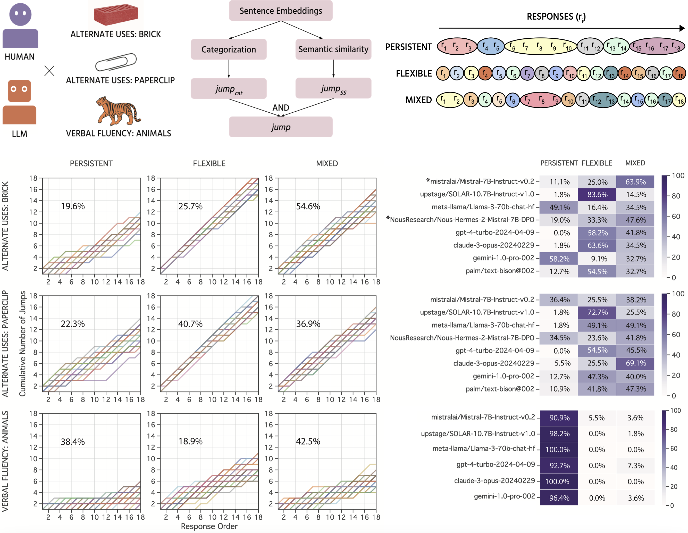

# Characterising the Creative Process in Humans and Large Language Models
[](https://www.python.org)
[](https://jupyterlab.readthedocs.io/en/stable)

This repository contains the data and scripts for the paper [Characterising the Creative Process in Humans and Large Language Models](https://psyarxiv.com/nuep7/) submitted to [ICCC'24](https://computationalcreativity.net/iccc24/). 
Authors: [Surabhi S Nath](https://surabhisnath.github.io), [Peter Dayan](https://www.mpg.de/12309357/biologische-kybernetik-dayan), [Claire Stevenson](https://www.uva.nl/en/profile/s/t/c.e.stevenson/c.e.stevenson.html)

## Abstract
Large language models appear quite creative, often performing on par with the average human on creative tasks. However, research on LLM creativity has focused solely on *products*, with little attention on the creative *process*. Process analyses of human creativity often require hand-coded categories or exploit response times, which do not apply to LLMs. We provide an automated method to characterise how humans and LLMs explore semantic spaces on the Alternate Uses Task, and contrast with behaviour in a Verbal Fluency Task. We use sentence embeddings to identify response categories and compute semantic similarities, which we use to generate jump profiles. Our results corroborate earlier work in humans reporting both persistent (deep search in few semantic spaces) and flexible (broad search across multiple semantic spaces) pathways to creativity, where both pathways lead to similar creativity scores. LLMs were found to be biased towards either persistent or flexible paths, that varied across tasks. Though LLMs as a population match human profiles, their relationship with creativity is different, where the more flexible models score higher on creativity.



## Repository Description
Human data files in `data`\
LLM data files in `data_LLM`\
Scripts to call LLMs in `scripts_LLM`\
Response embeddings in `embeddings`\
Response translations in `translations`\
Paper figures in `figures`\
All Analyses script in `scripts/Analysis.ipynb`\

## Setup
We recommend setting up a python virtual environment and installing all the requirements. Please follow these steps:

```bash
git clone https://github.com/surabhisnath/Creative_Process.git
cd Creative_Process

python3 -m venv .env

# On macOS/Linux
source .env/bin/activate
# On Windows
.env\Scripts\activate

pip install -r requirements.txt
```

## Running the code
To reproduce the results from the paper, run 
```bash
jupyter-lab
```
and open the file `scripts/Analysis.ipynb` and run the file (either in one go or cell by cell).

## Citation
If you found this work useful, please consider citing us:

```
@article{nath2024characterising,
  title={Characterising the Creative Process in Humans and Large Language Models},
  author={Nath, Surabhi S and Dayan, Peter and Stevenson, Claire},
  journal={arXiv preprint arXiv:2405.00899},
  year={2024}
}
```

## Contact
Please feel free to email us at nath.surabhi@tuebingen.mpg.de.